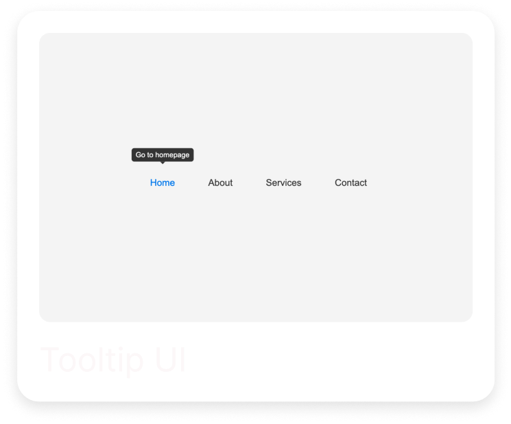
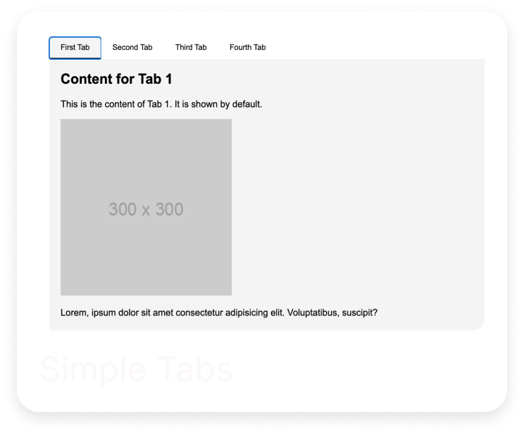
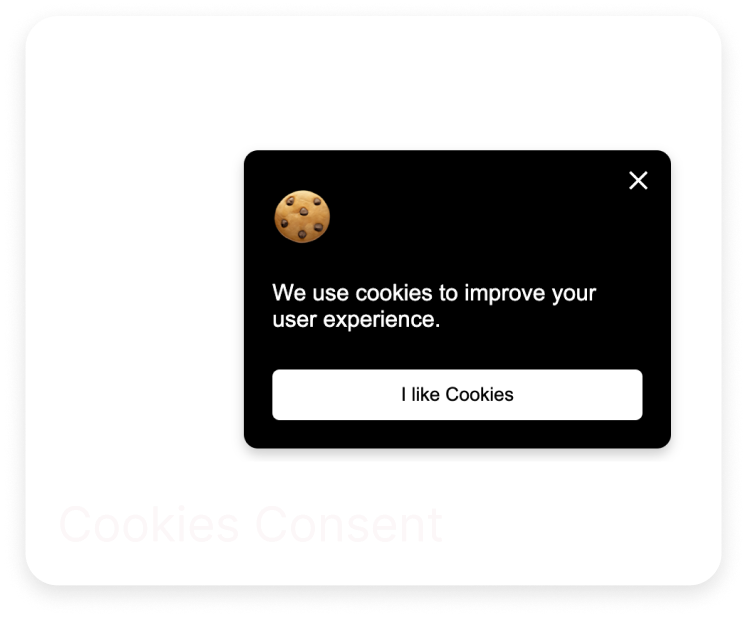

# Front-end Projects from Roadmap.sh

This repository contains front-end projects built following the [roadmap.sh](https://roadmap.sh/) front-end developer path.

Click any of the images below to view the readme and live demo of the project.

 
  

 
  

 
  

 
  

 
  <!--  -->

---

## [Frontend Projects](https://roadmap.sh/frontend)

- [x] [Basic HTML Website](https://roadmap.sh/projects/basic-html-website)
- [x] [Personal Portfolio](https://roadmap.sh/projects/portfolio-website)
- [x] [Changelog Component](https://roadmap.sh/projects/changelog-component)
- [x] [Testimonial Cards](https://roadmap.sh/projects/testimonial-cards)
- [x] [Datepicker UI](https://roadmap.sh/projects/datepicker-ui)
- [x] [Accessible Form UI](https://roadmap.sh/projects/accessible-form-ui)
- [x] [Image Grid Layout](https://roadmap.sh/projects/image-grid)
- [x] [Tooltip UI](https://roadmap.sh/projects/tooltip-ui)
- [x] [Simple Tabs](https://roadmap.sh/projects/simple-tabs)
- [x] [Cookie Consent](https://roadmap.sh/projects/cookie-consent)
- [x] [Restricted Textarea](https://roadmap.sh/projects/restricted-textarea)
- [x] [Accordion UI](https://roadmap.sh/projects/accordion)
- [x] [Custom Dropdown](https://roadmap.sh/projects/custom-dropdown)
- [x] [Task Tracker](https://roadmap.sh/projects/task-tracker-js)
- [x] [Github Random Repo](https://roadmap.sh/projects/github-random-repo)
- [x] [Reddit Client](https://roadmap.sh/projects/reddit-client)
- [x] [Temperature Converter](https://roadmap.sh/projects/temperature-converter)

## [Backend Projects](https://roadmap.sh/backend)

- [x] [Task Tracker](https://roadmap.sh/projects/task-tracker)
